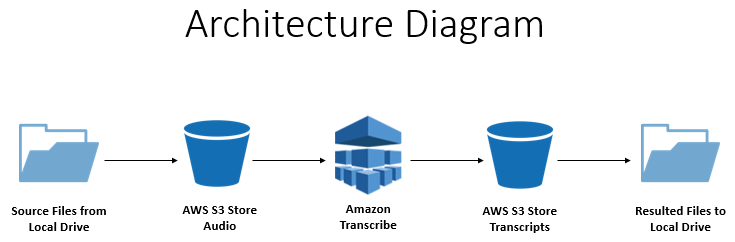

=================================================================================
Audio to Text Transcription using (AWS S3 & Transcribe) service - Concurrent Jobs
=================================================================================

* `About`_
* `Architecture Diagram`_
* `Getting Started`_
* `Required Libraries`_
* `Job Queuing Setup`_
* `How to Use?`_

About
-----
Shows how to use the AWS SDK for Python (Boto3) with the Amazon Transcribe API to transcribe an audio file to a text file. Also to export the transription JSON results into a meaningful Word docx file using Tscribe module.

More about Tscribe can be found here: https://pypi.org/project/tscribe/

Note: In this example, the transcription jobs are processed concurrently. Hence, Job Queuing is implemented. 

This example uses a main() function to execute all the following steps in order:

1. Rename all the input files into an acceptable name format, input path picked up from configuration.
2. Create buckets if not available and uploads all the input files into input bucket, input & output bucket name picked up from configuration.
3. Transcribes all the input audio files concurrently to save a lot of time.
4. All COMPLETED and FAILED jobs are separated and job results are exported into their respective csv file(s). The files  for e.g. 'job_summary_completed_xxxxxx.csv' are placed in output folder. 
5. Finally, the resulted JSON files are converted into a more meaningful Word docx file using Tscribe module and both JSON & Docx are exported into the output folder. The successfully completed audio files & resulted JSON are archived into 'Archive' folder. Jobs are deleted as a cleanup process on completion of the whole activity.

Architecture Diagram
--------------------

Getting Started
---------------
Assuming that you have Python and ``virtualenv`` installed, set up your environment and install the required dependencies like this or you can install the library using ``pip``:

.. code-block:: sh

    $ git clone https://github.com/Shufyan/python_aws_transcribe_concurrent.git
    $ cd python_aws_transcribe_concurrent
    $ virtualenv venv
    ...
    $ . venv/bin/activate
    $ python -m pip install -r requirements.txt
    $ python -m pip install -e .

.. code-block:: sh

    $ python -m pip install boto3

    
Using Boto3
~~~~~~~~~~~~~~
After installing boto3 

Next, set up credentials (in e.g. ``~/.aws/credentials``):

.. code-block:: ini

    [default]
    aws_access_key_id = YOUR_KEY
    aws_secret_access_key = YOUR_SECRET

Then, set up a default region (in e.g. ``~/.aws/config``):

.. code-block:: ini

   [default]
   region=us-east-1
    
Other credentials configuration method can be found `here <https://boto3.amazonaws.com/v1/documentation/api/latest/guide/credentials.html>`__

Then, from a Python interpreter:

.. code-block:: python

    >>> import boto3
    >>> s3 = boto3.resource('s3')
    >>> for bucket in s3.buckets.all():
            print(bucket.name)

Required Libraries
------------------
* Python 3.0+
* boto3
* tscribe

**Note:** In order to Tscribe work successfully, I need to "pip install PyQt5" in my environment. You may require if receive any error.

Job Queuing Setup
-----------------
When you send transcription jobs to Amazon Transcribe, there is a limit to the total number of jobs that can run at one time. By default, there are 100 slots for jobs. When the limit is reached, you must wait until one or more jobs have finished and freed up a slot before you can send your next job.

To queue jobs so that they run as soon as a slot becomes available, you can use job queuing. Job queuing creates a queue on your behalf that contains your jobs. When a slot is available, Amazon Transcribe takes the next job from the queue and immediately starts processing it. To allow resources for new jobs to be submitted and processed, Amazon Transcribe uses at most 90 percent of your slots to process jobs in the queue.

More details on **Job Queuing** can be found `here <https://docs.aws.amazon.com/transcribe/latest/dg/job-queuing.html#job-queuing-policy>`__

How to Use?
-----------
1. Download or Clone the repo to your local system.
2. “pip install <lib name>” the required libraries.
3. Set the required variables in the parameters.py.
4. Add some audio files in "input" folder.
5. Open the "code" folder in terminal and run the "transcribe_script.py" file.

 
